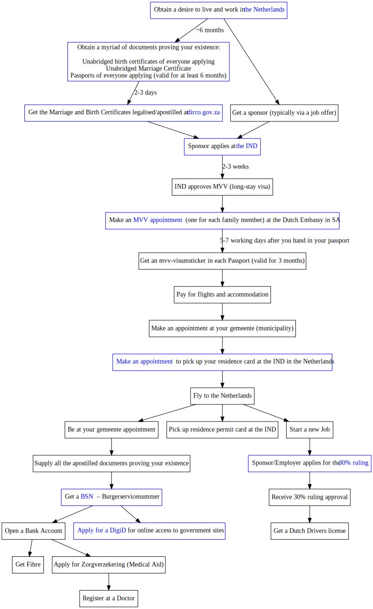

# Destination: the Netherlands

A brief sequence of steps showing what you need to do to move to and work in the Netherlands, coming from outside of Europe.

Some of the initial steps have links to South African websites, but I think the process should be similar for a person from any country
outside of the Netherlands

# SVG Object with Clickable Links

<object data="./img/za2nl.svg" type="image/svg+xml"></object>

# SVG image embedded with a Markdown Link

If you're viewing this as the [README](https://github.com/apauley/destination-nl/blob/master/README.md)
directly on [github.com](https://github.com/apauley/destination-nl), then you won't see the clickable SVG image.

For the clickable view, go to [https://pauley.org.za/destination-nl/index.html](https://pauley.org.za/destination-nl/index.html)

In the meantime, here is the same graph without clickable links:

